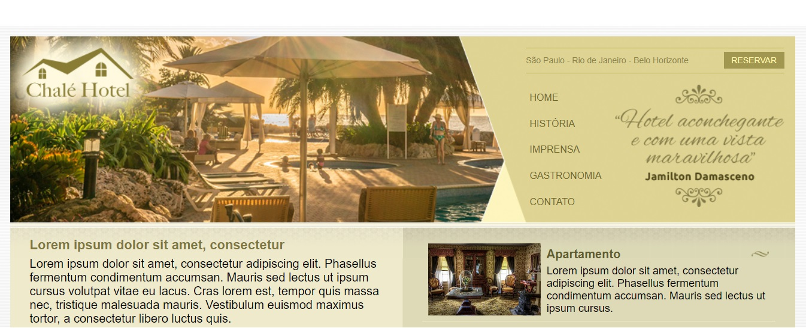

# News Portal (Notícias Cidade)

Welcome! 

This repository contains advertising page of a Hotel developed with the "liquid layout" structure, using intermediate resources of HTML5 and CSS3.

This project was developed during the [Complete Web Development](https://www.udemy.com/course/web-completo/) course (Section CSS3 Intermediate and Advanced) held at UDEMY.



# 🧠 About

The goal with this project is learn and practice about this functionalities below:

- [x] CSS selectors
- [x] Menu
- [x] Inheritance
- [x] Navigation bar
- [x] Layouts
- [x] Tables
- [x] Lists
- [x] Footer

## 🖥️ Installation

1. Clone this repo
```bash
git clone https://github.com/robernar2011/NewsPortal.git
```
